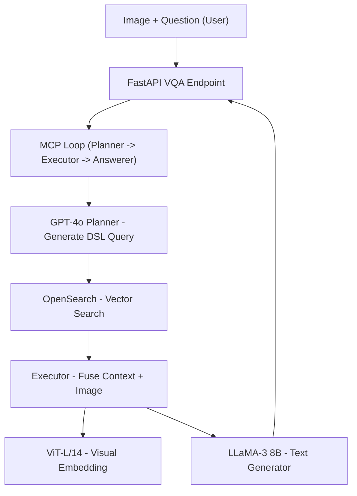

# 🧠 InSightAI: Agentic Visual Question Answering

> A multimodal, agentic AI system for real-time **Visual Question Answering (VQA)** using **Vision Transformers**, **OpenSearch**, **GPT-4o**, and **LLaMA-3 8B**.

---

## 🔍 Overview

InSightAI answers questions about input images by fusing **visual features**, **retrieved knowledge**, and **language reasoning**. It uses:

- A **Vision Transformer** (CLIP ViT-L/14) to encode the image
- An **Agentic Planner** powered by GPT-4o to generate OpenSearch DSL queries
- A **Retriever** that searches OpenSearch vector index over VQAv2 QA pairs
- A **LLaMA-3 8B** decoder-only model to generate the final answer
- A **metacognitive loop** that retries query plans until the answer is sufficient

---

## 🎯 Features

- ✅ Agentic RAG (retrieval-augmented generation) powered by GPT-4o
- ✅ CLIP ViT-L/14 for dense visual embeddings
- ✅ OpenSearch for persistent, scalable vector search
- ✅ LLaMA-3 8B for text generation from multimodal fused inputs
- ✅ Torch + Lightning-based fine-tuning and training
- ✅ FastAPI REST endpoint for real-time VQA
- ✅ Self-correcting answer loop (MCP-style)

---

## 🧠 Architecture



---

## 🚀 Getting Started

### 1️⃣ Setup Environment

```bash
git clone https://github.com/NeuralRevenant/InSightAI.git
cd insightai

# Install dependencies
pip install -r requirements.txt
```

Instead of having a config.py file for maintaining global config variables, a .env (environment) file could also be used to manage the config variables.

### 2️⃣ Start OpenSearch locally

```bash
docker run -d --name opensearch \
  -p 9200:9200 -e "discovery.type=single-node" \
  -e "plugins.security.disabled=true" \
  opensearchproject/opensearch:2.13.0
```

---

### 3️⃣ Prepare Dataset

```bash
python -m insightai.data.prepare_vqa
```

This loads the VQAv2 dataset and stores images + annotations locally.

---

### 4️⃣ Build OpenSearch Index

```bash
python -m insightai.retrieval.build_index
```

- Embeds images with `CLIP ViT-L/14`
- Stores QA pairs + dense vectors in OpenSearch

---

### 5️⃣ Fine-Tune Vision→Language Model

```bash
python -m insightai.train.train_multimodal
```

This trains the **projector + LM head** using Lightning on your GPU.

---

### 6️⃣ Launch the VQA Server

```bash
export OPENAI_API_KEY=<API-Key>       # required for GPT-4o planner
uvicorn insightai.app.main:app --host 0.0.0.0 --port 8000
```

---

## 🧪 Usage

### API Endpoint

```http
POST /vqa
Content-Type: multipart/form-data

Form Fields:
- image: (file)
- question: (string)
```

### Example with `curl`

```bash
curl -X POST http://localhost:8000/vqa \
     -F "question=What animal is this?" \
     -F "image=@example.jpg"
```

#### Response

```json
{
  "answer": "It is a golden retriever.",
  "reasoning": [
    "{ OpenSearch DSL 1 }",
    "{ OpenSearch DSL 2 }"
  ]
}
```

---

## 🧠 Agentic RAG: How It Works

1. **Planner** (GPT-4o) converts user query to OpenSearch DSL  
2. **Retriever** runs it against VQAv2 vector index (via ViT+CLIP)
3. **Executor** builds a contextual prompt: top-K QA + image
4. **LLaMA-3 8B** generates the final answer
5. If answer is weak, the **MCP loop** critiques and replans

---

## 🛠 Tech Stack

| Layer         | Tech                          |
|---------------|-------------------------------|
| Vision Model  | `openai/clip-vit-large-patch14` (CLIP) |
| Language Model| `meta-llama/Meta-Llama-3-8B-Instruct` |
| Query Planner | `gpt-4o` (via OpenAI API)     |
| Retriever     | `OpenSearch` (with knn_vector)|
| Serving       | `FastAPI + Uvicorn`           |
| Training      | `PyTorch Lightning`           |

---

## 📂 Project Structure

```
insightai/
├── app/              # FastAPI server
├── data/             # Dataset loader
├── models/           # ViT, LLaMA, projector, fusion
├── retrieval/        # OpenSearch index + retriever
├── agentic/          # Planner, executor, MCP loop
├── train/            # Fine-tuning pipeline
└── config.py         # Paths & hyperparameters
```

---

## 📜 License

MIT

---

## 🙌 Acknowledgements

- [LLaVA](https://github.com/haotian-liu/LLaVA)
- [OpenAI GPT-4o](https://platform.openai.com/docs/models/gpt-4o)
- [OpenSearch](https://opensearch.org)
- [CLIP](https://github.com/openai/CLIP)

---

## 💬 Contact

Feel free to contact me regarding issues, discussions, or collaborations.
